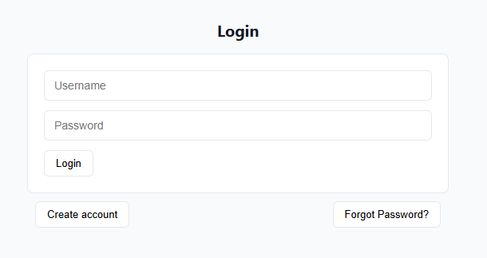
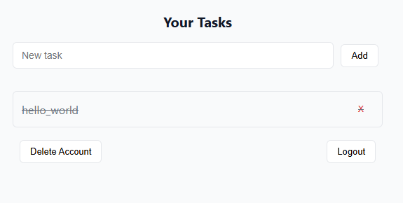

# Multiuser Task Manager (In Progress)

A full-stack web application for managing tasks with multiple users. Users can create accounts, log in securely, and manage their personal tasks in a clean, intuitive interface.

## Features

- User registration and authentication
- Secure password storage using Werkzeug hashing
- Add, track, delete, and mark tasks as completed
- Multiuser support with individual task lists
- Responsive frontend built with HTML, CSS, and Vanilla JavaScript
- Persistent storage using SQLite

## Tech Stack

- **Backend:** Flask, SQLAlchemy, SQLite, Werkzeug (password hashing)
- **Frontend:** HTML, CSS, Vanilla JavaScript

## Usage

- Register a new account or log in with existing credentials.
- Create new tasks with a title and optional description.
- Mark tasks as completed or delete them.
- Edit tasks as needed.

## Security

- Passwords are securely hashed using Werkzeug before storing in the database.
- Used environment variables for sensitive configuration like `SECRET_KEY`.   

---
Access: [Link](https://task-manager-oc13.onrender.com)    
---

## Demonstrations

